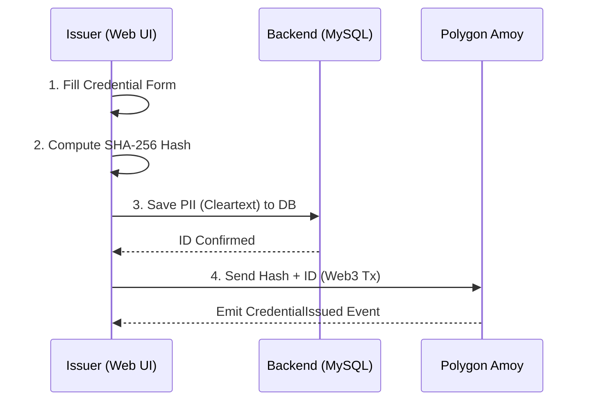

# ProofHer — Verifiable Skill Credentials for Women

## 4-Line Problem Frame
**User:** A woman who has acquired skills informally (e.g., tailoring, braiding, digital marketing, caregiving, coding, design) and needs trusted proof of her abilities for employment, clients, grants, or micro-financing.
**Problem:** Women in marginalized communities often lack formally recognized credentials. Paper certificates can be forged, screenshots can be faked, and employers cannot easily verify authenticity.
**Constraints:** Credentials must be privacy-safe (no PII on-chain), tamper-proof, and instantly verifiable by anyone.
**Success Test:** Issue a credential → Blockchain transaction confirms → Open verify page → System shows VALID, on-chain issuer address, timestamp, and endorsements. Achievable in under 60 seconds.

## Architecture Explanation
ProofHer uses a hybrid on-chain/off-chain architecture:

1. **Off-Chain Database (MySQL + PHP):** Stores human-readable personal information (PII) such as the recipient's name, skill, level, issuer name, and evidence URL.
2. **On-Chain Storage (Polygon Amoy Testnet):** Stores a SHA-256 hash of the canonical JSON representation of the off-chain data, along with the issuer's wallet address, timestamp, and endorsement count.
3. **Frontend (HTML/Tailwind/Vanilla JS + Ethers.js):** Connects the two components. It captures form data, computes the SHA-256 hash in the browser, sends the raw data to the backend, and sends the hash via MetaMask to the Polygon smart contract.

## How Hashing Works
To ensure the hash remains deterministic and completely tamper-resistant:
1. The frontend gathers the credential fields payload.
2. The object keys are sorted alphabetically `['credential_id', 'evidence_url', 'full_name', 'issued_date', 'issuer_name', 'level', 'skill']`.
3. The object is serialized to a JSON string.
4. The JSON string is hashed using the browser's native `crypto.subtle.digest('SHA-256')`.
5. The resulting Hex string (`0x...`) is mapped to a `bytes32` value and deployed.

## How Verification Works
1. A verifier visits the verification link or scans the QR code containing the `credential_id`.
2. The page fetches the corresponding raw payload from the backend MySQL database using the REST API (`api/credential.php`).
3. The page queries the Polygon Amoy blockchain using Ethers.js to retrieve the canonical on-chain hash and issuer information.
4. The page locally computes the SHA-256 hash of the database payload and compares it to the on-chain hash.
5. If they strictly match, the UI displays a green "✓ VALID CREDENTIAL" banner along with endorsements and blockchain verification links.

## Smart Contract Information
The ProofHer smart contract is already deployed on the **Polygon Amoy Testnet** at the address configured in `js/config.js`. The Solidity source code is available in the `contracts/` directory for audit and reference.

## 🛠️ Prerequisites: MetaMask Setup
To interact with ProofHer, you need a Web3 wallet.
1. **Install MetaMask**: Download and install the [MetaMask Extension](https://metamask.io/download/) for your browser (Chrome, Brave, Firefox, or Edge).
2. **Create/Import Wallet**: Follow the prompts to set up your wallet and securely back up your recovery phrase.
3. **Switch to Amoy Testnet**: When you visit the ProofHer site and click "Connect Wallet", the site will automatically prompt you to add and switch to the **Polygon Amoy Testnet**. Click "Approve" and "Switch Network" in MetaMask.

## ⛽ Getting Testnet MATIC (Gas Fees)
Transactions on the blockchain require "Gas Fees". Since ProofHer is on a testnet, you can get free test MATIC from a "Faucet":
1. **Copy your Address**: Open MetaMask and click on your account address (it starts with `0x...`) to copy it.
2. **Visit a Faucet**:
   - [Official Polygon Faucet](https://faucet.polygon.technology/) (Select Amoy Network)
   - [Alchemy Amoy Faucet](https://www.alchemy.com/faucets/polygon-amoy) (Highly reliable)
   - [QuickNode Faucet](https://faucet.quicknode.com/polygon/amoy)
3. **Request Funds**: Paste your address into the faucet and click "Submit". 
4. **Wait**: After 30–60 seconds, you will see ~0.5 to 1.0 MATIC in your MetaMask balance. You are now ready to issue or endorse credentials!

## How to Run Locally
1. Clone this repository into your XAMPP/MAMP `htdocs` directory (e.g., `C:\xampp\htdocs\ProofHer`).
2. Start the Apache and MySQL modules in your XAMPP control panel.
3. Import the database schema:
   - Go to phpMyAdmin (`http://localhost/phpmyadmin`).
   - Create a database called `proofher_db`.
   - Import `db/schema.sql` to create the `credentials` table.
4. Open your browser and navigate to: `http://localhost/ProofHer/index.html`.
5. Connect your MetaMask wallet (ensure it's on Polygon Amoy testnet) and test the flow!

## Demo Walkthrough Steps
For judging or live presentations, follow the steps in [docs/DEMO_SCRIPT.md](docs/DEMO_SCRIPT.md).
